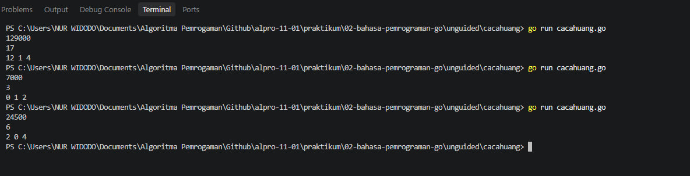
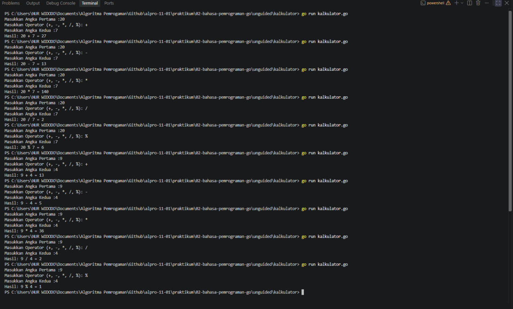

# <h1 align="center">Laporan Praktikum Modul 02 - Algoritma dan Pemrograman: Variabel, Tipe Data, dan Operasi</h1>
<p align="center">Nur Widodo - 109092630005</p>

## Dasar Teori

### A. Bahasa Pemrograman Go
Menurut Donovan & Kernighan (2015), Go (atau Golang) adalah bahasa pemrograman _open-source_ yang dirancang untuk memudahkan pembangunan perangkat lunak yang sederhana, cepat, dan handal. Go menyediakan dukungan bawaan untuk konkurensi serta sistem tipe data yang statis namun fleksibel, sehingga sangat cocok digunakan untuk pengembangan aplikasi sistem maupun komputasi modern.

### B. Variabel, Tipe Data, dan Operator Aritmatika di Go

#### 1. Deklarasi Variabel dan Tipe Data
Dalam bahasa pemrograman Go, variabel dideklarasikan dengan tipe data tertentu secara eksplisit maupun implisit. Pada program praktikum ini digunakan tipe data `int` untuk merepresentasikan bilangan bulat (nominal uang, skor, angka operasi) serta tipe data `string` untuk menyimpan teks seperti nama dan operator aritmatika (`+`, `-`, `*`, `/`, `%`).

#### 2. Operator Aritmatika dan Struktur Kontrol
Operator pembagian (`/`) dan _modulus_ (`%`) memainkan peran krusial dalam pemecahan masalah konversi nilai nominal uang: operator pembagian bilangan bulat menghasilkan jumlah lembar pecahan tertentu, sementara operator _modulus_ menghitung sisa nominal yang belum dikonversi ke pecahan yang lebih kecil.

Sementara itu, percabangan `switch` digunakan untuk mengevaluasi ekspresi operator yang dimasukkan pengguna dan mengarahkan eksekusi ke blok kode yang sesuai (penjumlahan, pengurangan, perkalian, pembagian, atau sisa bagi/_modulus_). Validasi kondisi juga dapat disematkan untuk mencegah kesalahan pembagian atau _modulus_ dengan angka nol (`b == 0`), guna menghindari _error runtime_ pada program.

## Guided

### 1. Nama File: skor.go

```go
package main

import "fmt"

func main() {
	var nama string
	var skorMatematika, skorBahasaInggris int

	//Membaca input
	fmt.Scan(&nama)
	fmt.Scan(&skorMatematika)
	fmt.Scan(&skorBahasaInggris)

	//Menghitung total & rata-rata (Pembagian bilangan bulat)
	total := skorMatematika + skorBahasaInggris
	rataRata := total / 2

	//Menampilkan output
	fmt.Println(nama)
	fmt.Println(total)
	fmt.Println(rataRata)
}
```
#### Deskripsi
Program ini membaca masukan berupa nama, skor Matematika, dan skor Bahasa Inggris, kemudian menghitung total skor serta rata-ratanya menggunakan pembagian bilangan bulat. Ketiga nilai hasil perhitungan kemudian ditampilkan ke layar secara berurutan.

### 2. Nama File: tukar.go

```go
package main

import "fmt"

func main() {
	var a, b int

	//Membaca input
	fmt.Scan(&a)
	fmt.Scan(&b)

	//Menukar a dan b
	a, b = b, a

	//Tampilkan output
	fmt.Println(a)
	fmt.Println(b)
}
```
#### Deskripsi
Program ini membaca dua bilangan bulat a dan b, kemudian menukar nilainya menggunakan penugasan berganda `a, b = b, a` yang tersedia di Go. Hasil penukaran kemudian ditampilkan ke layar.

## Unguided

### 1. cacahuang

```go
package main

import "fmt"

func main() {
	var uang int
	fmt.Scan(&uang)

	sepuluhRibu := uang / 10000
	sisa := uang % 10000

	limaRibu := sisa / 5000
	sisa = sisa % 5000

	seribu := sisa / 1000

	total := sepuluhRibu + limaRibu + seribu
	fmt.Println(total)
	fmt.Println(sepuluhRibu, limaRibu, seribu)

}
```

##### Output


#### Deskripsi
Praktikum ini membahas pembuatan program untuk menghitung pecahan mata uang berdasarkan total nominal uang yang diinputkan pengguna. Program menggunakan operator aritmatika pembagian bulat (`/`) dan sisa bagi atau _modulus_ (`%`) untuk memecah total uang ke dalam pecahan nominal Rp10.000, Rp5.000, dan Rp1.000. Program kemudian menampilkan total lembar pecahan serta rincian jumlah lembar untuk masing-masing pecahan tersebut.

### 2. kalkulator

```go
package main

import "fmt"

func main() {
	var a, b int
	var operator string

	//Input angka pertama
	fmt.Print("Masukkan Angka Pertama :")
	fmt.Scan(&a)

	//Pilih operator
	fmt.Print("Masukkan Operator (+, -, *, /, %): ")
	fmt.Scan(&operator)

	//Input angka kedua
	fmt.Print("Masukkan Angka Kedua :")
	fmt.Scan(&b)

	//Menampilkan hasil
	switch operator {
	case "+":
		fmt.Printf("Hasil: %d + %d = %d\n", a, b, a+b)
	case "-":
		fmt.Printf("Hasil: %d - %d = %d\n", a, b, a-b)
	case "*":
		fmt.Printf("Hasil: %d * %d = %d\n", a, b, a*b)
	case "/":
		if b == 0 {
			fmt.Println("Error: Pembagian dengan nol tidak diperbolehkan!")
		} else {
			fmt.Printf("Hasil: %d / %d = %d\n", a, b, a/b)
		}
	case "%":
		if b == 0 {
			fmt.Println("Error: Modulus dengan nol tidak diperbolehkan!")
		} else {
			fmt.Printf("Hasil: %d %% %d = %d\n", a, b, a%b) // Gunakan %% untuk mencetak simbol % di Printf
		}
	default:
		fmt.Println("Operator tidak dikenal!")
	}
}
```

##### Output


#### Deskripsi
Praktikum ini membahas pembuatan program kalkulator sederhana menggunakan bahasa Go. Program menerima tiga input dari pengguna, yaitu angka pertama, operator aritmatika, dan angka kedua. Berdasarkan operator yang dipilih, program menggunakan struktur kontrol _switch-case_ untuk mengeksekusi operasi aritmatika yang sesuai (`+`, `-`, `*`, `/`, dan `%`). Selain itu, program juga dilengkapi dengan validasi logika kondisi guna menangani _error_ apabila pengguna mencoba melakukan pembagian atau sisa _modulus_ dengan angka nol.

## Kesimpulan
Berdasarkan praktikum yang telah dilakukan, dapat disimpulkan bahwa:

1. Bahasa pemrograman Go menyediakan tipe data dasar seperti `int` dan `string` serta fungsi _input-output_ melalui _package_ `fmt` yang sangat mendukung pembuatan program interaktif sederhana.
2. Kombinasi operator pembagian (`/`) dan _modulus_ (`%`) sangat efektif untuk menyelesaikan masalah komputasi terstruktur seperti konversi pecahan nilai mata uang.
3. Struktur percabangan _switch-case_ sangat efektif digunakan untuk menangani percabangan kondisi jamak seperti pemilihan operator kalkulator.
4. Penanganan kondisi khusus (seperti validasi pembagian dengan nol) sangat penting untuk mencegah gangguan eksekusi program atau _runtime error_.
5. Alur logika program yang runtut dari pembacaan _input_, proses kalkulasi bertahap, hingga pencetakan hasil akhir memastikan program berjalan dengan akurat dan sesuai harapan.

## Referensi
1. Sumber resmi Golang https://go.dev/
2. Jurnal modul 02 - Golang - Telkom University
