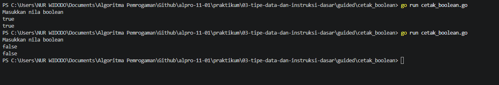
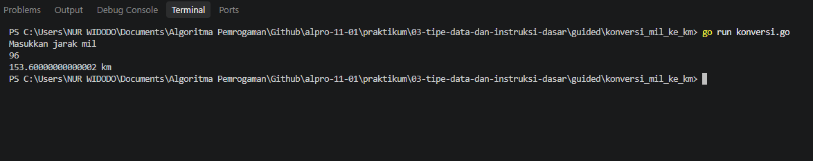

# <h1 align="center">Laporan Praktikum Modul 003 - Tipe Data dan Instruksi Dasar</h1>
<p align="center">Nur Widodo - 109092630005O</p>

## Guided

### 1. Cetak Boolean

### 1. cetak_boolean.go

```go
package main

import "fmt"

func main() {
	var bool bool

	fmt.Println("Masukkan nila boolean")
	fmt.Scan(&bool)

	fmt.Println(bool)
}

```

##### Output
<!-- Path relatif dari readme.md ke folder unguided/[nama_soal]/output.png, contoh: -->



#### Deskripsi
Program membaca sebuah nilai boolean (true atau false) dari input pengguna, lalu mencetaknya kembali apa adanya. Nilai disimpan dalam variabel bool bertipe bool.

Hasil uji:
- input true → keluaran true
- input false → keluaran false

## Kesimpulan
Program ini mempraktikkan cara membaca dan mencetak nilai boolean di Go. Nilai true atau false disimpan dalam variabel bertipe bool, dibaca dengan fmt.Scan, lalu dicetak kembali apa adanya. Hasil pengujian menunjukkan input true menghasilkan keluaran true dan input false menghasilkan keluaran false, sesuai dengan yang diminta soal.

### 2. Kasir

### 1. kasir.go

```go
package main

import "fmt"

func main() {
	var x int
	fmt.Scan(&x)

	var sepuluhRibuan int = x / 10000
	var sisa int = x % 10000

	var limaRibuan int = sisa / 5000
	sisa = sisa % 5000

	var seribuan int = sisa / 1000

	fmt.Println(sepuluhRibuan, limaRibuan, seribuan)
}

```

##### Output
<!-- Path relatif dari readme.md ke folder unguided/[nama_soal]/output.png, contoh: -->


#### Deskripsi
Program ini ditulis dalam bahasa Go (Golang) untuk memecah atau mengonversi suatu jumlah uang (bilangan bulat x) ke dalam pecahan lembar uang yang lebih kecil, yaitu pecahan 10.000, 5.000, dan 1.000. Program menggunakan operasi pembagian bulat (/) untuk menentukan jumlah lembar uang dan operator sisa bagi atau modulo (%) untuk membawa sisa nilai uang ke pecahan berikutnya secara berurutan.

## Kesimpulan
- Pecahan Nilai Beruntun: Memanfaatkan kombinasi operator pembagian (/) dan modulo (%) secara berantai untuk menghitung jumlah lembar pecahan uang dari nominal terbesar hingga terkecil berdasarkan sisa nominal sebelumnya.
- Efisiensi Alur Variabel: Menerapkan pembaruan nilai variabel sisa secara fleksibel (sisa = sisa % 5000) untuk melacak sisa uang yang belum dikonversi pada setiap tahapan pecahan.

### 3. Konversi Mil Ke Km

### 1. konversi.go

```go
package main

import "fmt"

func main() {
	var mil float64

	fmt.Println("Masukkan jarak mil")
	fmt.Scan(&mil)

	fmilkm := mil * 1.6
	fmt.Println(fmilkm, "km")

}


```

##### Output
<!-- Path relatif dari readme.md ke folder unguided/[nama_soal]/output.png, contoh: -->


#### Deskripsi
Program membaca sebuah nilai boolean (true atau false) dari input pengguna, lalu mencetaknya kembali apa adanya. Nilai disimpan dalam variabel bool bertipe bool.

Hasil uji:
- input true → keluaran true
- input false → keluaran false


## Kesimpulan
Program ini mempraktikkan konversi satuan jarak menggunakan tipe data float64 dan perkalian. Nilai jarak dalam mil dikalikan dengan 1.6 untuk menghasilkan nilai dalam kilometer. Dari pengujian, input 1 menghasilkan 1.6 km. Program juga mempraktikkan cara memformat bilangan desimal: dengan fmt.Printf("%.1fkm", hasil) keluaran menjadi tepat satu angka di belakang koma, sehingga input 1.25 menghasilkan 2.0km dan input 2 menghasilkan 3.2km.

### 4. Konversi Suhu

### 1. konversi_suhu.go

```go
package main

import "fmt"

func main() {
	var c float64

	fmt.Println("Masukkan suhu celcius")
	fmt.Scan(&c)

	k := c + 273
	fmt.Println(k, "kelvin")

}
}

```

##### Output
<!-- Path relatif dari readme.md ke folder unguided/[nama_soal]/output.png, contoh: -->


#### Deskripsi
Program ini ditulis dalam bahasa Go (Golang) untuk mengonversi suhu dari derajat Celsius menjadi derajat Kelvin. Program menerima masukan bilangan real (floating-point) yang merepresentasikan suhu dalam Celsius, kemudian menghitung dan menampilkan hasilnya menggunakan rumus Kelvin:

$$K = C \times 273$$

## Kesimpulan
- Operasi Aritmatika Sederhana: Memanfaatkan penambahan dasar (c + 273) untuk mengonversi nilai suhu dari skala Celsius ke Kelvin.
- Penggunaan Tipe Data Bilangan Real: Menggunakan tipe data float64 (var c float64) untuk menampung nilai masukan suhu agar tetap fleksibel dan akurat.

### 5. Sisa Kue

### 1. sisa_kue.go

```go
package main

import "fmt"

func main() {
	var x, y int

	fmt.Println("Masukkan jumlah kue: ")
	fmt.Scan(&y)

	fmt.Println("Masukkan jumlah anggota keluarga: ")
	fmt.Scan(&x)

	sisa := y % x
	fmt.Println("Sisa kue adalah: ", sisa)

}

```

##### Output
<!-- Path relatif dari readme.md ke folder unguided/[nama_soal]/output.png, contoh: -->


#### Deskripsi
Program membaca dua bilangan bulat, yaitu y (jumlah kue) dan x (jumlah anggota keluarga). Jumlah kue sisa setelah dibagi rata dihitung menggunakan operator sisa bagi (%), yang menghasilkan sisa pembagian y dibagi x. Nilai sisa tersebut kemudian dicetak.

## Kesimpulan
Program ini mempraktikkan penggunaan operator sisa bagi (%) pada bilangan bulat. Jumlah kue y dibagi rata kepada x anggota keluarga, dan sisa pembagian itulah hasilnya. Dari pengujian, 10 kue untuk 5 orang menghasilkan sisa 0, sedangkan 11 kue untuk 5 orang menghasilkan sisa 1. Operator % hanya bisa digunakan pada tipe bilangan bulat, sehingga variabelnya harus bertipe int.

## Unguided

### 1. Konversi Hari

### 1. konversi_hari.go

```go
package main

import "fmt"

func main() {
	var totalHari int
	fmt.Print("Masukkan Jumlah Hari: ")
	fmt.Scan(&totalHari)

	hariPertahun := 360
	hariPerbulan := 30
	hariPerminggu := 7

	tahun := totalHari / hariPertahun
	sisaHari := totalHari % hariPertahun

	bulan := sisaHari / hariPerbulan
	sisaHari = sisaHari % hariPerbulan

	minggu := sisaHari / hariPerminggu
	hari := sisaHari % hariPerminggu

	fmt.Printf("%d hari setara dengan: %d tahun, %d bulan, %d minggu, dan %d hari.\n", totalHari, tahun, bulan, minggu, hari)
}

```

##### Output
<!-- Path relatif dari readme.md ke folder unguided/[nama_soal]/output.png, contoh: -->


#### Deskripsi
Program ini ditulis dalam bahasa Go (Golang) untuk mengonversi jumlah hari ke dalam satuan waktu yang lebih besar, yaitu tahun, bulan, minggu, dan sisa hari.

Program dirancang menggunakan aturan perhitungan waktu standar konversi sederhana:

- 1 tahun = 12 bulan (360 hari)
- 1 bulan = 30 hari
- 1 minggu = 7 hari

Melalui pendekatan operasi pembagian bulat (/) dan sisa bagi atau modulo (%), program secara beruntun memecah total hari masukan dari pengguna hingga mendapatkan sisa hari terkecil.

## Kesimpulan
- Logika Konversi Beruntun: Memanfaatkan operator pembagian (/) dan modulo (%) secara berantai di mana satuan waktu berikutnya dihitung dari sisa hari sebelumnya.
- Aturan Sintaks Go: Mematuhi aturan wajib deklarasi variabel, memastikan setiap variabel digunakan, serta menggunakan fmt.Printf untuk pencetakan berformat.

### 2. Konversi Suhu

### 1. konversi_suhu.go

```go
package main

import "fmt"

func main() {
	var c float64

	fmt.Println("Masukkan suhu celcius")
	fmt.Scan(&c)

	r := (4.0 / 5.0) * c
	fmt.Println(r, "Reamur")

}

```

##### Output
<!-- Path relatif dari readme.md ke folder unguided/[nama_soal]/output.png, contoh: -->


#### Deskripsi
Program ini ditulis dalam bahasa Go (Golang) untuk mengonversi suhu dari derajat Celsius menjadi derajat Reamur. Program menerima masukan bilangan real (floating-point) yang merepresentasikan suhu dalam Celsius, kemudian menghitung dan menampilkan hasilnya menggunakan rumus konversi:

$$R = (4/5) \times C$$

## Kesimpulan
- Penggunaan Tipe Data Pecahan: Memanfaatkan tipe data float64 untuk menangani bilangan real agar hasil perhitungan suhu presisi dan akurat.
- Penerapan Rumus Matematis: Menerapkan operasi aritmatika dasar Go dengan membedakan bentuk pecahan (4.0 / 5.0) guna mencegah pembagian bulat (integer division).

## Catatan

Folder `guided/tukar_nilai` memiliki file program `tukar_nilai.go`, tetapi tidak ditemukan file `laptp_Modul03.md`. Karena laporan ini disusun berdasarkan file `laptp_Modul03.md` yang tersedia, folder tersebut tidak dimasukkan ke dalam isi laporan.

## Kesimpulan Umum

Praktikum Modul 003 membahas tipe data dan instruksi dasar dalam bahasa Go melalui latihan pada bagian guided dan unguided. Materi yang dipraktikkan mencakup penggunaan tipe data `int`, `float64`, dan `bool`, input/output menggunakan paket `fmt`, operasi aritmatika, pembagian bulat, operator modulo (`%`), serta konversi satuan. Hasil latihan menunjukkan bahwa konsep-konsep dasar tersebut dapat diterapkan untuk menyelesaikan permasalahan sederhana secara terstruktur.
