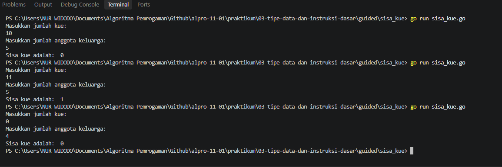

# <h1 align="center">Tugas Pendahuluan Modul 003 - Tipe Data dan Instruksi Dasar</h1>
<p align="center">Nur Widodo - 109092630005O</p>

### 1. sisa_kue.go

```go
package main

import "fmt"

func main() {
	var x, y int

	fmt.Println("Masukkan jumlah kue: ")
	fmt.Scan(&y)

	fmt.Println("Masukkan jumlah anggota keluarga: ")
	fmt.Scan(&x)

	sisa := y % x
	fmt.Println("Sisa kue adalah: ", sisa)

}

```

##### Output
<!-- Path relatif dari readme.md ke folder unguided/[nama_soal]/output.png, contoh: -->



#### Deskripsi
Program membaca dua bilangan bulat, yaitu y (jumlah kue) dan x (jumlah anggota keluarga). Jumlah kue sisa setelah dibagi rata dihitung menggunakan operator sisa bagi (%), yang menghasilkan sisa pembagian y dibagi x. Nilai sisa tersebut kemudian dicetak.

## Kesimpulan
Program ini mempraktikkan penggunaan operator sisa bagi (%) pada bilangan bulat. Jumlah kue y dibagi rata kepada x anggota keluarga, dan sisa pembagian itulah hasilnya. Dari pengujian, 10 kue untuk 5 orang menghasilkan sisa 0, sedangkan 11 kue untuk 5 orang menghasilkan sisa 1. Operator % hanya bisa digunakan pada tipe bilangan bulat, sehingga variabelnya harus bertipe int.