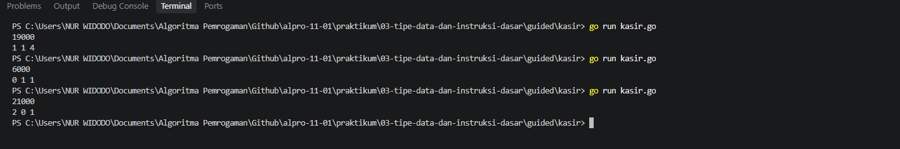
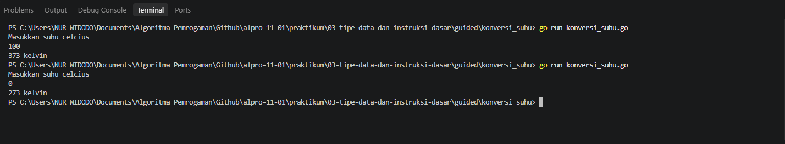
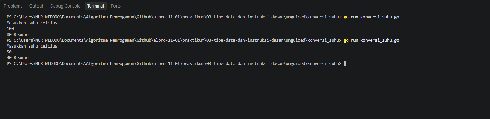
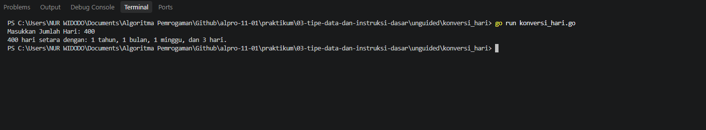

# <h1 align="center">Laporan Praktikum Modul 03 - Pengenalan Bahasa Pemrograman Go</h1>
<p align="center">Nur Widodo - 109092630005</p>

## Dasar Teori

### A. Bahasa Pemrograman Go

Go (Golang) adalah bahasa pemrograman yang dikembangkan oleh Google dan dirancang untuk pengembangan perangkat lunak yang sederhana, cepat, dan aman. Bahasa ini bertipe statis, artinya tipe setiap variabel ditentukan sejak awal dan diperiksa saat kompilasi. Program Go dikompilasi menjadi satu berkas biner sehingga dapat dijalankan langsung tanpa mesin virtual.

Go menyediakan paket standar yang cukup lengkap, salah satunya paket `fmt` yang dipakai untuk keperluan masukan dan keluaran (_input/output_).

### B. Struktur Program di Go

#### 1. _Package_ dan _Function_ main

Setiap berkas program Go harus diawali dengan deklarasi `package`. Berkas yang dapat dijalankan secara mandiri menggunakan `package main`, dan di dalamnya wajib terdapat `func main()` sebagai titik awal program dijalankan oleh _compiler_.

#### 2. Tipe Data dan Deklarasi Variabel

Tipe data yang digunakan pada praktikum ini adalah:
1. `int`, untuk menyimpan bilangan bulat.
2. `float64`, untuk menyimpan bilangan real atau desimal.

Variabel dapat dideklarasikan secara eksplisit dengan kata kunci `var` beserta tipenya, atau secara singkat dengan `:=` yang tipenya disimpulkan dari nilai yang diberikan. Go juga mewajibkan setiap variabel yang dideklarasikan untuk digunakan.

### C. Operator dan Format Keluaran

Operator yang digunakan pada praktikum ini yaitu pembagian bulat (`/`) dan sisa bagi atau _modulo_ (`%`). Kedua operator tersebut dapat dirangkai secara beruntun untuk memecah sebuah nilai menjadi beberapa bagian.

Untuk menampilkan keluaran, `fmt.Println` mencetak nilai apa adanya, sedangkan `fmt.Printf` mencetak dengan format tertentu menggunakan _format specifier_ seperti `%d` untuk bilangan bulat.

## Guided

### 1. Nama File: kasir.go

```go
package main

import "fmt"

func main() {
	var x int
	fmt.Scan(&x)

	var sepuluhRibuan int = x / 10000
	var sisa int = x % 10000

	var limaRibuan int = sisa / 5000
	sisa = sisa % 5000

	var seribuan int = sisa / 1000

	fmt.Println(sepuluhRibuan, limaRibuan, seribuan)
}
```
#### Output


#### Deskripsi
Program ini ditulis dalam bahasa Go (Golang) untuk memecah atau mengonversi suatu jumlah uang (bilangan bulat x) ke dalam pecahan lembar uang yang lebih kecil, yaitu pecahan 10.000, 5.000, dan 1.000. Program menggunakan operasi pembagian bulat (`/`) untuk menentukan jumlah lembar uang dan operator sisa bagi atau _modulo_ (`%`) untuk membawa sisa nilai uang ke pecahan berikutnya secara berurutan.

### 2. Nama File: konversi_suhu.go

```go
package main

import "fmt"

func main() {
	var c float64

	fmt.Println("Masukkan suhu celcius")
	fmt.Scan(&c)

	k := c + 273
	fmt.Println(k, "kelvin")

}
```
#### Output


#### Deskripsi
Program ini ditulis dalam bahasa Go (Golang) untuk mengonversi suhu dari derajat Celsius menjadi derajat Kelvin. Program menerima masukan bilangan real (_floating-point_) yang merepresentasikan suhu dalam Celsius, kemudian menghitung dan menampilkan hasilnya menggunakan rumus Kelvin:

$$K = C + 273$$

### 3. Nama File: tukar_nilai.go

```go
package main

import "fmt"

func main() {
	var x, y, z int
	fmt.Scan(&x, &y, &z)

	temp := x
	x = z
	z = y
	y = temp

	fmt.Println(x, y, z)
}
```
#### Deskripsi
Program ini ditulis dalam bahasa Go (Golang) untuk menukar posisi tiga nilai masukan dari a, b, c menjadi c, a, b. Program menggunakan sebuah variabel bantu `temp` untuk menyimpan nilai sementara agar nilai yang ditimpa tidak hilang saat proses penukaran berlangsung. Nilai masukan dibaca sekaligus dengan `fmt.Scan(&x, &y, &z)` dan hasil akhirnya dicetak menggunakan `fmt.Println`.

## Unguided

### 1. Konversi Suhu

```go
package main

import "fmt"

func main() {
	var c float64

	fmt.Println("Masukkan suhu celcius")
	fmt.Scan(&c)

	r := (4.0 / 5.0) * c
	fmt.Println(r, "Reamur")

}
```

##### Output


#### Deskripsi
Program ini ditulis dalam bahasa Go (Golang) untuk mengonversi suhu dari derajat Celsius menjadi derajat Reamur. Program menerima masukan bilangan real (_floating-point_) yang merepresentasikan suhu dalam Celsius, kemudian menghitung dan menampilkan hasilnya menggunakan rumus konversi:

$$R = (4/5) \times C$$

Pecahan ditulis sebagai `4.0 / 5.0` agar perhitungan dilakukan dalam bilangan desimal, sebab pembagian dua bilangan bulat pada Go akan menghasilkan pembagian bulat.

### 2. Konversi Hari

```go
package main

import "fmt"

func main() {
	var totalHari int
	fmt.Print("Masukkan Jumlah Hari: ")
	fmt.Scan(&totalHari)

	hariPertahun := 360
	hariPerbulan := 30
	hariPerminggu := 7

	tahun := totalHari / hariPertahun
	sisaHari := totalHari % hariPertahun

	bulan := sisaHari / hariPerbulan
	sisaHari = sisaHari % hariPerbulan

	minggu := sisaHari / hariPerminggu
	hari := sisaHari % hariPerminggu

	fmt.Printf("%d hari setara dengan: %d tahun, %d bulan, %d minggu, dan %d hari.\n", totalHari, tahun, bulan, minggu, hari)
}
```

##### Output


#### Deskripsi
Program ini ditulis dalam bahasa Go (Golang) untuk mengonversi jumlah hari ke dalam satuan waktu yang lebih besar, yaitu tahun, bulan, minggu, dan sisa hari.

Program dirancang menggunakan aturan perhitungan waktu standar konversi sederhana:

- 1 tahun = 12 bulan (360 hari)
- 1 bulan = 30 hari
- 1 minggu = 7 hari

Melalui pendekatan operasi pembagian bulat (`/`) dan sisa bagi atau _modulo_ (`%`), program secara beruntun memecah total hari masukan dari pengguna hingga mendapatkan sisa hari terkecil. Hasil akhir dicetak dengan `fmt.Printf` dan _format specifier_ `%d`.

## Kesimpulan

Berdasarkan hasil praktikum pada modul ini, dapat disimpulkan bahwa:

1. **Pecahan nilai beruntun.** Kombinasi operator pembagian (`/`) dan _modulo_ (`%`) yang dirangkai secara berantai dapat menghitung jumlah lembar pecahan uang dari nominal terbesar hingga terkecil, di mana setiap tahap dihitung dari sisa nominal tahap sebelumnya.
2. **Pembaruan nilai variabel.** Variabel sisa dapat diperbarui secara fleksibel (`sisa = sisa % 5000`) untuk melacak nilai yang belum dikonversi pada setiap tahapan pecahan.
3. **Operasi aritmatika sederhana.** Penambahan dasar (`c + 273`) dimanfaatkan untuk mengonversi nilai suhu dari skala Celsius ke Kelvin.
4. **Penggunaan tipe data bilangan real.** Tipe data `float64` dipakai untuk menampung masukan suhu agar perhitungan tetap fleksibel dan akurat, serta untuk menangani bilangan real pada konversi Reamur.
5. **Penerapan rumus matematis.** Operasi aritmatika dasar diterapkan dengan memperhatikan bentuk pecahan (`4.0 / 5.0`) guna mencegah pembagian bulat (_integer division_).
6. **Logika konversi beruntun.** Satuan waktu berikutnya dihitung dari sisa hari sebelumnya, sehingga total hari dapat dipecah menjadi tahun, bulan, minggu, dan hari.
7. **Aturan sintaks Go.** Program mematuhi aturan Go berupa kewajiban deklarasi variabel, kewajiban penggunaan setiap variabel yang dideklarasikan, serta pencetakan berformat dengan `fmt.Printf`.

## Referensi
1. Go Team. (2026). _The Go Programming Language Specification_. Google LLC. Diakses pada 04 Oktober 2026 melalui https://go.dev/ref/spec.
