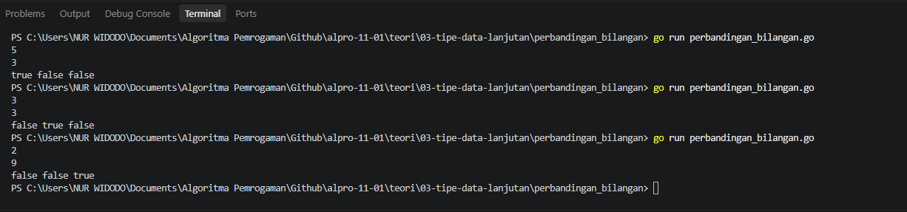
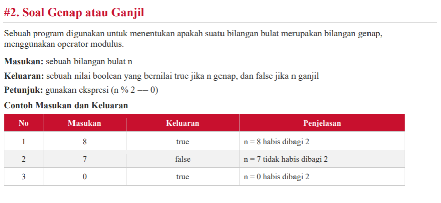
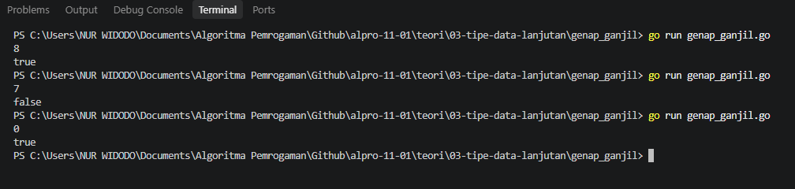
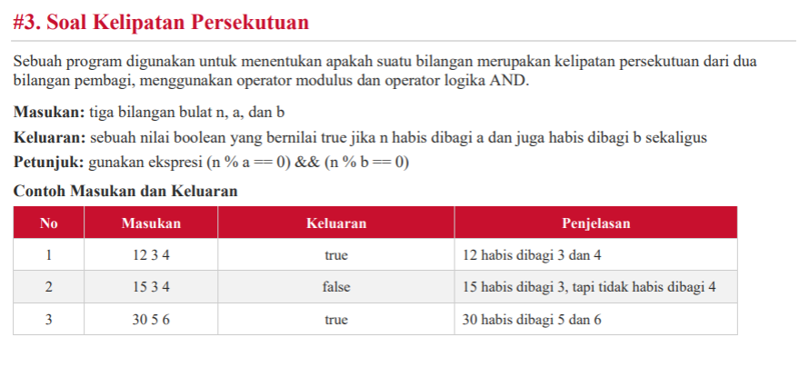
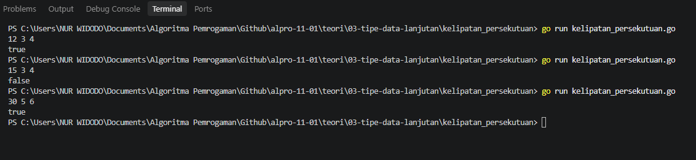
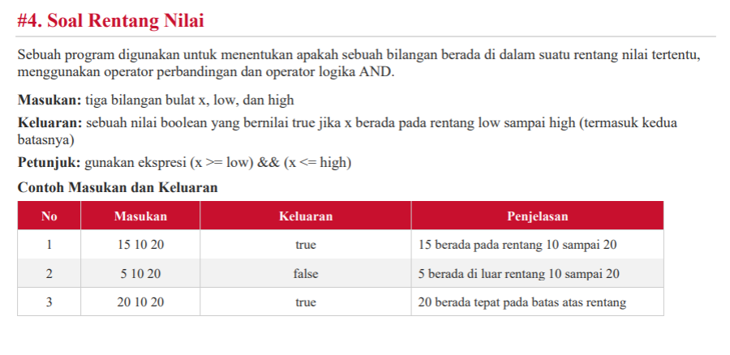
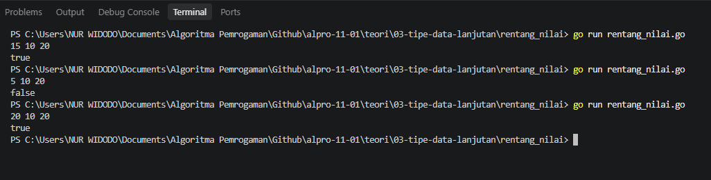
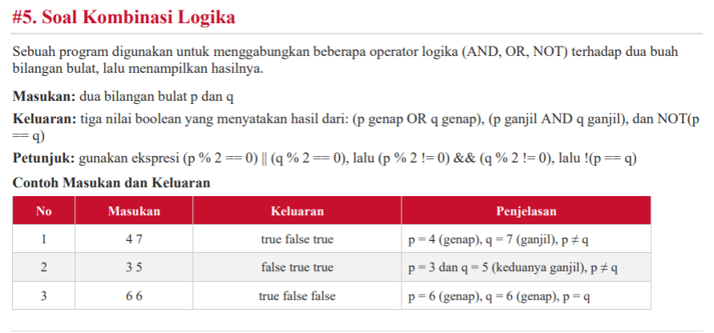
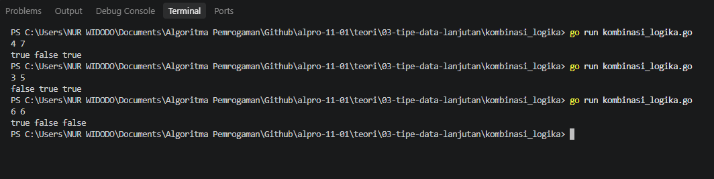

# <h1 align="center">Tugas Individu: Tipe Data Lanjutan</h1>
<p align="center">Nur Widodo - 109092630005O</p>


### 1. Perbandingan Bilangan

##### A. Soal
<!-- Path relatif dari readme.md ke folder unguided/[nama_soal]/output.png, contoh: -->


##### B. Pseudecode

```
PROGRAM perbandingan_bilangan
DEKLARASI
    a, b : integer

ALGORITMA
    INPUT a, b
    OUTPUT (a > b), (a == b), (a < b)
END PROGRAM

```

##### C. Golang: perbandingan_bilangan.go

```go
package main

import "fmt"

func main() {
	var a, b int

	fmt.Scan(&a)
	fmt.Scan(&b)

	fmt.Println(a > b, a == b, a < b)
}

```

##### D. Output
<!-- Path relatif dari readme.md ke folder unguided/[nama_soal]/output.png, contoh: -->



### 2. Ganjil dan Genap

##### A. Soal
<!-- Path relatif dari readme.md ke folder unguided/[nama_soal]/output.png, contoh: -->



##### B. Pseudecode

```
PROGRAM ganjil_genap
DEKLARASI
    n : integer
	hasil : boolean
ALGORITMA
    INPUT n
    hasil ← (n % 2 == 0)
    OUTPUT hasil
END PROGRAM
```

##### C. Golang: ganjil_genap.go

```go
package main

import "fmt"

func main() {
	var n int
	var hasil boolean
	fmt.Scan(&n)

	hasil := n%2 == 0

	println(hasil)
}

```

##### D. Output
<!-- Path relatif dari readme.md ke folder unguided/[nama_soal]/output.png, contoh: -->



### 3. Kelipatan Persekutuan

##### A. Soal
<!-- Path relatif dari readme.md ke folder unguided/[nama_soal]/output.png, contoh: -->



##### B. Pseudecode

```
PROGRAM kelipatan_persekutuan
DEKLARASI
    n, a, b : integer

ALGORITMA
    INPUT n, a, b
    OUTPUT (n % a == 0) AND (n % b == 0)
END PROGRAM

```

##### C. Golang: kelipatan_persekutuan.go

```go
package main

import "fmt"

func main() {
	var n, a, b int

	fmt.Scan(&n, &a, &b)
	fmt.Println(n%a == 0 && n%b == 0)
}
```

##### D. Output
<!-- Path relatif dari readme.md ke folder unguided/[nama_soal]/output.png, contoh: -->



### 4. Rentang Nilai

##### A. Soal
<!-- Path relatif dari readme.md ke folder unguided/[nama_soal]/output.png, contoh: -->



##### B. Pseudecode

```
PROGRAM rentang_nilai
DEKLARASI
    x, low, high : integer

ALGORITMA
    INPUT x, low, high
    OUTPUT (x >= low) AND (x <= high)
END PROGRAM

```

##### C. Golang: perbandingan_bilangan.go

```go
package main

import "fmt"

func main() {
	var x, low, high int
	fmt.Scan(&x, &low, &high)
	fmt.Println(x >= low && x <= high)
}

```

##### D. Output
<!-- Path relatif dari readme.md ke folder unguided/[nama_soal]/output.png, contoh: -->



### 5. Kombinasi Logika

##### A. Soal
<!-- Path relatif dari readme.md ke folder unguided/[nama_soal]/output.png, contoh: -->



##### B. Pseudecode

```
PROGRAM kombinasi_logika
DEKLARASI
    p, q : integer

ALGORITMA
    INPUT p, q
    OUTPUT (p % 2 == 0) OR (q % 2 == 0),
           (p % 2 != 0) AND (q % 2 != 0),
           NOT (p == q)
END PROGRAM

```

##### C. Golang: perbandingan_bilangan.go

```go
package main

import "fmt"

func main() {
	var p, q int
	fmt.Scan(&p, &q)

	fmt.Println(p%2 == 0 || q%2 == 0, p%2 != 0 && q%2 != 0, p != q)
}
```

##### D. Output
<!-- Path relatif dari readme.md ke folder unguided/[nama_soal]/output.png, contoh: -->



